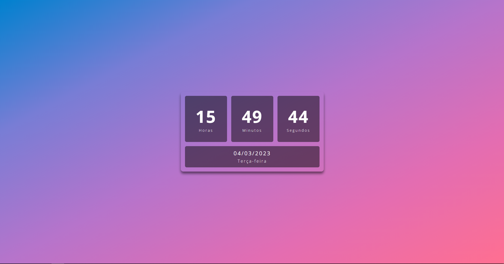
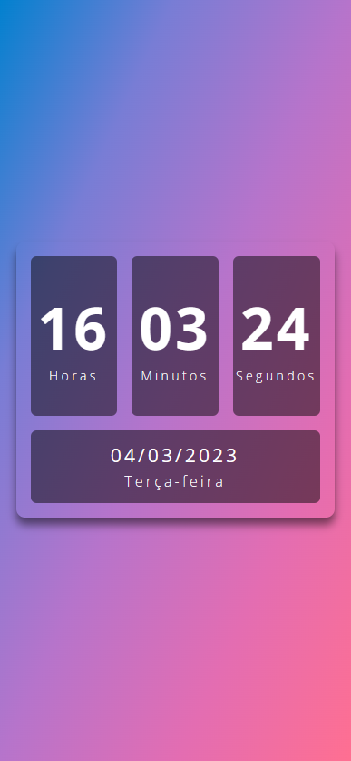
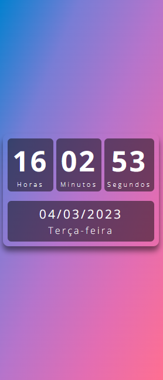
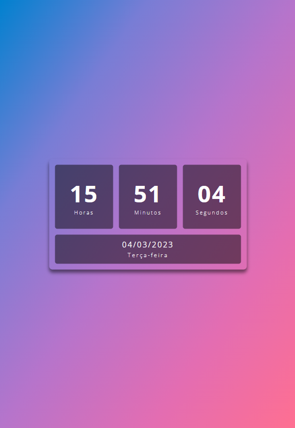

<h1 align="center"> ⌚ Relógio digital com Data 📆 </h1>

Esta é uma página web com um relógio digital e data.

  

 

## ⌚ Projetp

A ideia inicial de um relógio digital foi baseada em um vídeo do YouTube no canal de
<a href="https://github.com/Larissakich">Larissa Kich</a>.
A fim de treinar mais o JavaScript, adicionei a funciondalide de mostrar também a data completa e o dia da semana.

## ⌚ Tecnologias

Esse projeto foi desenvolvido com as seguintes tecnologias:

- HTML e CSS
- JavaScript
- Git e Github
- Figma
- Flexbox

## ⌚ Preview site

- [Clique aqui](https://nicoledpizetta.github.io/Relogio-Digital)

## ⌚ Screenshots

#### Desktop

#### Mobile

#### Tablet

## ⌚ Recursos úteis

- [Assistir ao vídeo de Larissa Kich](https://www.youtube.com/watch?v=GK0ok3ZCXwM&list=PLlhPWsetD9-otvR1UYWZBzP8JzPn3OlO2&index=21&ab_channel=LarissaKich)

## :memo: Licença

Esse projeto está sob a licença MIT.

---

 Feito com ♥ por <a href="https://github.com/NicoleDPizetta">Nicole Dalzotto Pizetta</a> 

---
